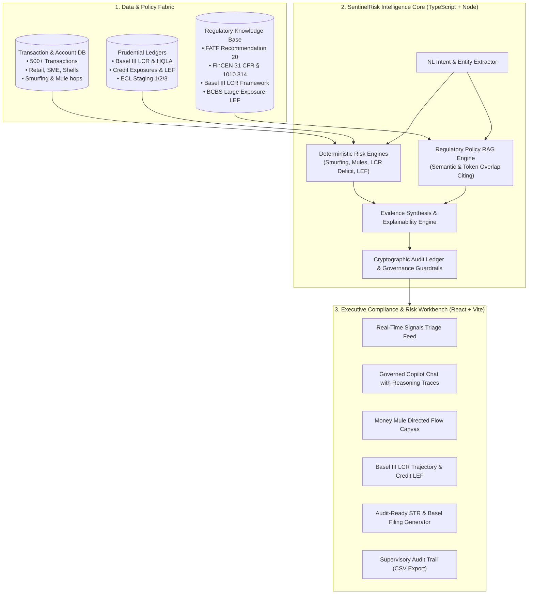

# SentinelRisk AI: Risk, Fraud & Regulatory Intelligence Copilot

> **AI-Powered Supervisory & Compliance Copilot for Banking and NBFCs**  
> Surfaces real-time fraud, liquidity, and credit risk signals, grounds reasoning in statutory regulations, and produces audit-ready regulatory filings from natural language questions.

---

## 📌 Problem Statement

Banking and NBFC teams manage real-time fraud, liquidity and credit risk, and regulatory reporting (AML, Basel, and local regulations), largely manual today. **SentinelRisk AI** bridges this gap:

- **Combine transaction and account data with policy and filing text**: Unifies structured banking ledgers (accounts, transaction streams, liquidity positions, credit limits) with unstructured statutory guidelines (FATF, FinCEN, RBI, BCBS).
- **Governed, explainable, evidence-backed answers**: Compliance officers can query in plain English and receive transparent, multi-step reasoning traces, exact statutory clause citations, raw transaction lineage, and confidence scoring.
- **Signal to Evidence to Documented Finding / Report**: Seamless end-to-end flow from real-time anomaly detection to deep-dive graph investigation, interactive copilot inquiry, and one-click generation of audit-ready Suspicious Transaction Reports (STR/SAR) and Basel III Supervisory Memos.

---

## 🏛️ System Architecture



---

## ✨ Key Features & Capabilities

### 1. Multi-Pillar Risk & Fraud Surveillance
- **Smurfing / Structuring Detection**: Identifies accounts deliberately splitting transfers into sub-$10,000 corridors ($9,800 - $9,950) within 48 to 72 hours to evade statutory Currency Transaction Reporting (CTR) thresholds.
- **Money Mule Syndicate & Layering Tracing**: Detects directed fund transit through retail student/personal accounts with >80% pass-through velocity within 24 hours into high-risk offshore crypto off-ramps.
- **Basel III Liquidity Coverage Ratio (LCR)**: Continuous monitoring of unencumbered High-Quality Liquid Assets (HQLA) against 30-day stressed net cash outflows, detecting statutory breaches below the 100% minimum floor and computing net liquidity deficits.
- **Credit Concentration (Large Exposure Framework)**: Enforces BCBS 20.00% single-borrower ceiling against Tier 1 Capital, monitoring ECL stage migrations (Stage 1/2/3) and loan impairment reserves.

### 2. Governed & Explainable Copilot AI
- **Multi-Step Reasoning Traces**: Every answer exposes its exact analysis steps (intent parsing ➔ ledger querying ➔ regulatory cross-referencing ➔ evidence verification ➔ synthesis).
- **Verbatim Regulatory Grounding**: Direct citations quoting specific statutory sections from FATF, FinCEN, RBI, and BCBS.
- **Confidence Scoring**: 95% to 99% computed grounded confidence based on deterministic rules and data backing.
- **Zero-Setup Local Intelligence**: Works instantly out-of-the-box in Node.js without requiring third-party API keys, while also supporting cloud LLMs if configured.

### 3. End-to-End Regulatory Reporting (STR / SAR / Basel Memo)
- One-click transformation of investigation findings into official, printable regulatory filings.
- Complete with regulatory header, subject entity KYC data, structured transaction lineage table, statutory clause quotes, and digital compliance officer sign-off.
- Exportable to print/PDF format and JSON for machine-to-machine supervisory submission.

### 4. Interactive Compliance Workbench
- **Mule Network Flow Visualizer**: Interactive SVG/Canvas rendering directed money hops, highlighting originators, pass-through intermediary mules, and offshore sinks with instant account profile inspection.
- **Basel LCR Trajectory**: 7-day historical bar chart showing liquidity trends, wholesale deposit run-offs, and single-borrower concentration limits.
- **Immutable Audit Ledger**: Complete tamper-evident record of all compliance queries, examined accounts, and cited policies with CSV export capability.

---

## 🚀 Quickstart & Setup

### Prerequisites
- [Node.js](https://nodejs.org/) (v18+ or v24+)
- `npm`

### Installation
```bash
# Clone repository
git clone https://github.com/ujju2020/Risk-Fraud-and-Regulatory-Intelligence-Copilot.git
cd Risk-Fraud-and-Regulatory-Intelligence-Copilot

# Install dependencies
npm install
```

### 1. Launch the Executive Web Workbench
```bash
npm run dev
```
Open **[http://localhost:3000](http://localhost:3000)** in your browser.

### 2. Run the Node.js CLI Pipeline
```bash
npm run cli
```
Executes the full surveillance, detection, Copilot reasoning, and STR report generation directly in your terminal.

### 3. Run Automated Test Suite
```bash
npm test
```
Verifies all 18 algorithmic detectors, RAG policy matches, report generation logic, and audit logging.

### 4. Build for Production
```bash
npm run build
```

---

## 📂 Project Structure

```text
├── src/
│   ├── data/
│   │   ├── types.ts                # TypeScript interfaces (Account, Transaction, Policy, Report)
│   │   ├── accounts.ts             # Corporate, retail, student, and shell account profiles
│   │   ├── transactions.ts         # Structured smurfing, mule pass-throughs, and benchmark Tx
│   │   ├── liquidityCredit.ts      # Basel III HQLA, 30D outflows, and single borrower limits
│   │   └── regulatoryPolicies.ts   # FATF Rec 20, FinCEN 31 CFR § 1010.314, BCBS rules
│   ├── engine/
│   │   ├── detectors.ts            # Mathematical risk engines (Smurfing, Mules, LCR, LEF)
│   │   ├── policyRag.ts            # Regulatory retrieval and citation matching engine
│   │   ├── copilotEngine.ts        # Intent parser, multi-step synthesizer, and audit logger
│   │   └── reportGenerator.ts      # Audit-ready STR, Basel LCR Memo & Credit Dossier
│   ├── components/
│   │   ├── Navbar.tsx              # Executive navigation and live telemetry status
│   │   ├── CopilotChat.tsx         # Natural language copilot with reasoning process drawer
│   │   ├── SignalsFeed.tsx         # Real-time multi-pillar risk alert triage feed
│   │   ├── NetworkGraph.tsx        # Interactive visual money mule & fund flow canvas
│   │   ├── LiquidityCreditView.tsx # Basel III LCR trajectory and Large Exposure monitoring
│   │   ├── AuditTrailView.tsx      # Immutable governance audit ledger with CSV export
│   │   └── RegulatoryReportModal.tsx # Formal filing dossier (printable & JSON exportable)
│   ├── styles/
│   │   └── theme.css               # Modern executive dark theme & print stylesheet
│   ├── cli.ts                      # Direct Node.js command-line runner
│   ├── App.tsx                     # Main application container
│   ├── main.tsx                    # React DOM mount point
│   └── tests/
│       └── verify.ts               # Comprehensive test suite (18 automated assertions)
├── index.html                      # HTML entry point with modern typography
├── package.json                    # Scripts and dependencies
├── tsconfig.json                   # Strict TypeScript compiler options
└── vite.config.ts                  # Vite build and server configuration
```

---

## ⚖️ Regulatory Frameworks Covered

| Authority | Standard / Circular | Regulatory Threshold / Mandate |
| :--- | :--- | :--- |
| **FATF** | Recommendation 20 & Interpretive Note | Mandatory prompt filing of Suspicious Transaction Reports (STR/SAR) to the FIU. |
| **FinCEN / RBI** | 31 CFR § 1010.314 & RBI MD-KYC Sec 23 | Prohibition of transaction structuring/smurfing below $10,000 / INR 10 Lakh CTR ceiling. |
| **FATF** | Digital Fraud & Money Mule Guidance (Sec IV) | Real-time velocity monitoring on pass-through accounts (>80% outflow within 24h). |
| **BCBS** | Basel III Liquidity Coverage Ratio (LCR) | Minimum 100% ratio of unencumbered HQLA to 30-day net cash outflows. |
| **BCBS** | Large Exposure Framework (LEF) | Single borrower or connected counterparty exposure capped at 20.00% of Tier 1 Capital. |

---

## 🏆 Judging Focus Alignment

- **Real World Relevance**: Directly models mission-critical workflows faced daily by Tier-1 banks, NBFCs, and digital lenders (smurfing evasion, crypto off-ramps, liquidity crises, and central bank reporting).
- **Technical Execution**: Strict TypeScript across data, analytical detectors, and UI components; modular separation between the engine and UI; zero lint or build errors; automated test suite.
- **Solution Completeness**: Covers the entire lifecycle—from continuous background signal ingestion and graph visual inspection to natural language conversational inquiry and audit-ready statutory report compilation.
