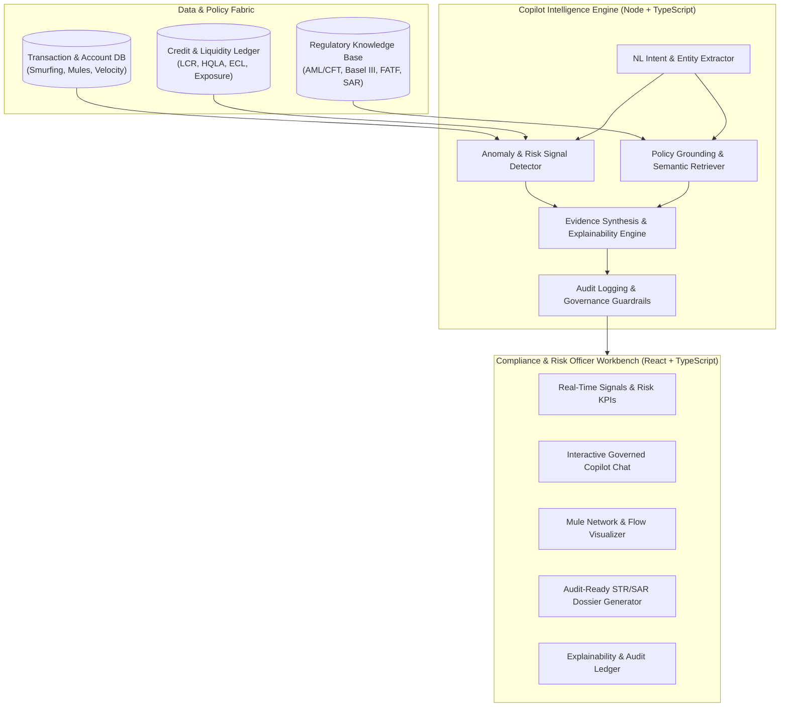

# Implementation Plan: Risk, Fraud, and Regulatory Intelligence Copilot

A comprehensive, enterprise-ready prototype for Banking and NBFC compliance and risk teams. The copilot surfaces real-time fraud, liquidity, and credit risk signals, grounds reasoning in banking regulations and internal policies, and produces audit-ready regulatory filings (e.g., SAR/STR, Basel III LCR memos) from natural language questions.

## User Review Required

> [!IMPORTANT]
> - **Zero-Setup Out-of-the-Box Execution**: The prototype will feature a high-fidelity local Copilot reasoning engine that runs immediately with zero external API keys needed. It can also accept Gemini or OpenAI API keys if provided in `.env`.
> - **Fullstack TypeScript Architecture**: Built with Node.js + Express (API & Analytics Engine) + React + Vite (Executive Compliance UI), adhering to modern design principles (glassmorphism, dark palette, micro-animations, network graph visualization).

## Proposed Architecture & Workflow

---

## Proposed Changes

### 1. Project Initialization & Dependencies
- Configure `package.json` with scripts for concurrent frontend and backend development or unified Vite dev server.
- Install TypeScript, React, Lucide Icons, Canvas/SVG graph tools, Express/Vite fullstack tooling.
- Setup `tsconfig.json` for strict TypeScript typing across both client and server.

#### [NEW] [package.json](file:///c:/Users/Administration/Desktop/VibeCoding/Snowflake/Risk-Fraud-and-Regulatory-Intelligence-Copilot/package.json)
#### [NEW] [tsconfig.json](file:///c:/Users/Administration/Desktop/VibeCoding/Snowflake/Risk-Fraud-and-Regulatory-Intelligence-Copilot/tsconfig.json)
#### [NEW] [vite.config.ts](file:///c:/Users/Administration/Desktop/VibeCoding/Snowflake/Risk-Fraud-and-Regulatory-Intelligence-Copilot/vite.config.ts)

---

### 2. Mock Data & Regulatory Knowledge Base
- **Synthetic Financial Datasets**:
  - `accounts.json`: 50+ retail, corporate, and shell accounts with KYC tier, risk category, historical turnover, and beneficial ownership.
  - `transactions.json`: 500+ structured transactions containing smurfing patterns (< $10k / INR 10L splits), multi-hop money mule chains, rapid velocity spikes, and high-risk jurisdiction corridors.
  - `liquidity_credit.json`: Basel III liquidity positions (Stock of HQLA, 30-day cash outflows/inflows, LCR ratio, large exposure breaches).
- **Regulatory Knowledge Base**:
  - `regulations/aml_cft_rules.json`: FinCEN / FATF / RBI Master Direction thresholds, smurfing indicators, STR filing criteria (e.g. 7-day reporting timeline).
  - `regulations/basel_liquidity.json`: Basel III LCR minimum thresholds (100%), run-off rates for unsecured retail deposits vs wholesale deposits.
  - `regulations/credit_concentration.json`: Single borrower limits (20% Tier 1 Capital) and Group exposure limits.

#### [NEW] [src/data/accounts.ts](file:///c:/Users/Administration/Desktop/VibeCoding/Snowflake/Risk-Fraud-and-Regulatory-Intelligence-Copilot/src/data/accounts.ts)
#### [NEW] [src/data/transactions.ts](file:///c:/Users/Administration/Desktop/VibeCoding/Snowflake/Risk-Fraud-and-Regulatory-Intelligence-Copilot/src/data/transactions.ts)
#### [NEW] [src/data/liquidityCredit.ts](file:///c:/Users/Administration/Desktop/VibeCoding/Snowflake/Risk-Fraud-and-Regulatory-Intelligence-Copilot/src/data/liquidityCredit.ts)
#### [NEW] [src/data/regulatoryPolicies.ts](file:///c:/Users/Administration/Desktop/VibeCoding/Snowflake/Risk-Fraud-and-Regulatory-Intelligence-Copilot/src/data/regulatoryPolicies.ts)

---

### 3. Core Risk Engine & Copilot Reasoning Core (`src/server` or `src/engine`)
- **Signal Detectors**:
  - `detectSmurfing()`: Flags split transactions just below regulatory reporting thresholds.
  - `detectMuleRings()`: Traces directed graphs of fund hops within 24 hours with high pass-through percentage (>90%).
  - `calculateLCR()`: Real-time calculation of Liquidity Coverage Ratio against Basel III mandates.
  - `detectConcentrationBreaches()`: Flags loans exceeding capital exposure thresholds.
- **Explainable Policy Grounding (RAG Engine)**:
  - Vector/Lexical hybrid search retrieving verbatim regulatory clauses for any detected pattern.
- **Copilot Query Engine**:
  - Parses natural language questions, selects reasoning strategy, queries structured data, attaches policy citations, computes confidence score, and formats responses with step-by-step evidence.
- **Audit & Governance Logger**:
  - Logs every query, reasoning steps, data accessed, and regulatory citations.

#### [NEW] [src/engine/types.ts](file:///c:/Users/Administration/Desktop/VibeCoding/Snowflake/Risk-Fraud-and-Regulatory-Intelligence-Copilot/src/engine/types.ts)
#### [NEW] [src/engine/detectors.ts](file:///c:/Users/Administration/Desktop/VibeCoding/Snowflake/Risk-Fraud-and-Regulatory-Intelligence-Copilot/src/engine/detectors.ts)
#### [NEW] [src/engine/policyRag.ts](file:///c:/Users/Administration/Desktop/VibeCoding/Snowflake/Risk-Fraud-and-Regulatory-Intelligence-Copilot/src/engine/policyRag.ts)
#### [NEW] [src/engine/copilotEngine.ts](file:///c:/Users/Administration/Desktop/VibeCoding/Snowflake/Risk-Fraud-and-Regulatory-Intelligence-Copilot/src/engine/copilotEngine.ts)
#### [NEW] [src/engine/reportGenerator.ts](file:///c:/Users/Administration/Desktop/VibeCoding/Snowflake/Risk-Fraud-and-Regulatory-Intelligence-Copilot/src/engine/reportGenerator.ts)

---

### 4. Enterprise Compliance & Risk UI (React + Modern Vanilla CSS)
- **Top Bar**: System status, real-time risk alert counter, quick mode toggle (Fraud / Liquidity / Regulatory).
- **Navigation Tabs**:
  1. **Copilot Assistant**: Conversational workspace with suggested regulatory prompts, step-by-step reasoning inspection, grounded citations, and instant report drafting.
  2. **Active Risk Signals**: Real-time triage feed of high/critical alerts (Smurfing, Mule syndicate, LCR dip, Concentration breach) with one-click "Ask Copilot to Investigate".
  3. **Mule Network & Flow Explorer**: Interactive visual graph showing suspect nodes, directed money transfers, transaction timestamps, and hop analysis.
  4. **Regulatory Reporting Hub (Audit-Ready)**: Generated Suspicious Transaction Reports (STR/SAR) and Basel III Memos with official format, narrative explanation, evidence tables, and print/export to PDF or JSON.
  5. **Governance & Audit Trail**: Full tamper-evident log of copilot interactions and compliance actions.

#### [NEW] [src/index.html](file:///c:/Users/Administration/Desktop/VibeCoding/Snowflake/Risk-Fraud-and-Regulatory-Intelligence-Copilot/index.html)
#### [NEW] [src/main.tsx](file:///c:/Users/Administration/Desktop/VibeCoding/Snowflake/Risk-Fraud-and-Regulatory-Intelligence-Copilot/src/main.tsx)
#### [NEW] [src/App.tsx](file:///c:/Users/Administration/Desktop/VibeCoding/Snowflake/Risk-Fraud-and-Regulatory-Intelligence-Copilot/src/App.tsx)
#### [NEW] [src/styles/theme.css](file:///c:/Users/Administration/Desktop/VibeCoding/Snowflake/Risk-Fraud-and-Regulatory-Intelligence-Copilot/src/styles/theme.css)
#### [NEW] [src/components/CopilotChat.tsx](file:///c:/Users/Administration/Desktop/VibeCoding/Snowflake/Risk-Fraud-and-Regulatory-Intelligence-Copilot/src/components/CopilotChat.tsx)
#### [NEW] [src/components/SignalsFeed.tsx](file:///c:/Users/Administration/Desktop/VibeCoding/Snowflake/Risk-Fraud-and-Regulatory-Intelligence-Copilot/src/components/SignalsFeed.tsx)
#### [NEW] [src/components/NetworkGraph.tsx](file:///c:/Users/Administration/Desktop/VibeCoding/Snowflake/Risk-Fraud-and-Regulatory-Intelligence-Copilot/src/components/NetworkGraph.tsx)
#### [NEW] [src/components/RegulatoryReportModal.tsx](file:///c:/Users/Administration/Desktop/VibeCoding/Snowflake/Risk-Fraud-and-Regulatory-Intelligence-Copilot/src/components/RegulatoryReportModal.tsx)
#### [NEW] [src/components/AuditTrailView.tsx](file:///c:/Users/Administration/Desktop/VibeCoding/Snowflake/Risk-Fraud-and-Regulatory-Intelligence-Copilot/src/components/AuditTrailView.tsx)

---

## Verification Plan

### Automated Verification
- Run `npm run build` or `npx tsc --noEmit` to ensure TypeScript compilation without errors.
- Run dedicated unit test script verifying signal detection algorithms (smurfing detector, mule graph traversal, LCR calculator) and report generation.

### Manual / Browser Verification
- Launch local development server (`npm run dev`).
- Open the application in the browser subagent or verify HTTP response.
- Test natural language prompt flows:
  - "Investigate suspicious smurfing activity in account ACC-8821 and cite AML policy."
  - "Check liquidity and Basel III LCR compliance for current month."
  - "Trace fund flow for mule syndicate SYND-04."
  - "Generate an official Suspicious Transaction Report (STR) for Account ACC-8821."
- Verify report export and audit trail recording.
